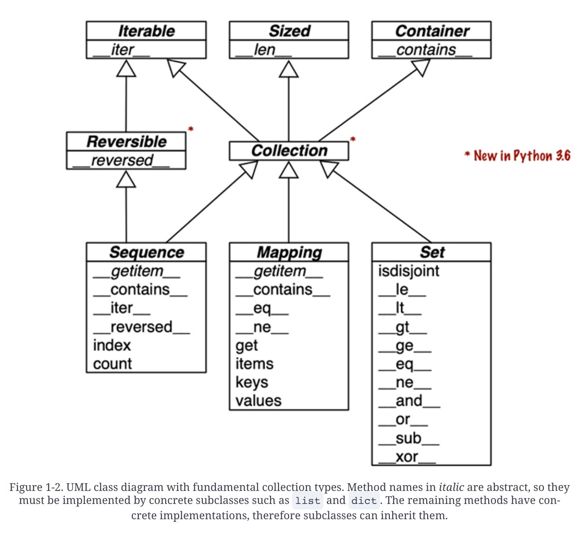

# The Python Data Model
The Python interpreter invokes special methods to perform basic object operations, often triggered by special syntax. The special method names are always written with leading and trailing double underscores. For example, the syntax obj[key] is supported by the `__getitem__` special method. In order to evaluate my_collection[key], the interpreter calls my_collection.`__getitem__(key)`.

## A Pythonic Card Deck

```python
import collections
from random import choice

Card = collections.namedtuple("Card", ["rank", "suit"])
```

The first thing to note is the use of collections.namedtuple to construct a simple class to represent individual cards. We use namedtuple to build classes of objects that are just bundles of attributes with no custom methods, like a database record.

```python
print(choice(deck))
```
We’ve just seen two advantages of using special methods to leverage the Python Data Model:

* Users of your classes don’t have to memorize arbitrary method names for standard operations. (“How to get the number of items? Is it .size(), .length(), or what?”)

* It’s easier to benefit from the rich Python standard library and avoid reinventing the wheel, like the random.choice function

```python
print(deck[:3])
print(deck[12:13])
```
Because our `__getitem__` delegates to the [] operator of self._cards, our deck automatically supports slicing. It also makes it iterable.

```python
for card in deck:
    print(card)
```

Iteration is often implicit. If a collection has no \__contains__ method, the in operator does a sequential scan. Case in point: in works with our FrenchDeck class because it is iterable.

```python
Card('Q', 'diamonds') in deck
Card('T', 'none') in deck
```

By implementing the special methods `__len__` and `__getitem__`, our FrenchDeck behaves like a standard Python sequence, allowing it to benefit from core language features (e.g., iteration and slicing) and from the standard library, as shown by the examples using random.choice, reversed, and sorted. Thanks to composition, the `__len__` and `__getitem__` implementations can delegate all the work to a list object, self._cards.

```python
# Sort the suits
suit_values = dict(spades = 3, hearts = 2, diamonds = 1, clubs = 0)

def spades_high(card):
    rank_value = FrenchDeck.ranks.index(card.rank)
    return rank_value * len(suit_values) + suit_values[card.suit]

for card in sorted(deck, key=spades_high):
    print(card)
```

## How Special Methods are Used
The first thing to know about special methods is that they are meant to be called by the Python interpreter, and not by you. You don’t write `my_object.__len__()`. You write `len(my_object)` and, if my_object is an instance of a user-defined class, then Python calls the `__len__` method you implemented. If `my_object` is an instance of one of those built-ins, then len(my_object) retrieves the value of the ob_size field, and this is much faster than calling a method.

## String Representation
The `__repr__` special method is called by the repr built-in to get the string representation of the object for inspection. Without a custom `__repr__`, Python’s console would display a Vector instance `<Vector object at 0x10e100070>`.

The interactive console and debugger call repr on the results of the expressions evaluated, as does the `%r` placeholder in classic formatting with the `%` operator, and the `!r` conversion field in the new format string syntax used in f-strings the `str.format` method.

## Boolean Value of a Custom Type
By default, instances of user-defined classes are considered truthy, unless either `__bool__` or `__len__` is implemented. Basically, `bool(x)` calls `x.__bool__()` and uses the result. If `__bool__` is not implemented, Python tries to invoke `x.__len__()`, and if that returns zero, `bool` returns `False`. Otherwise `bool` returns `True`.

Our implementation of `__bool__` is conceptually simple: it returns `False` if the magnitude of the vector is zero, `True` otherwise. We convert the magnitude to a Boolean using `bool(abs(self))` because `__bool__` is expected to return a Boolean. 

## Collection API
All the classes in the diagram are ABCs—abstract base classes. 
